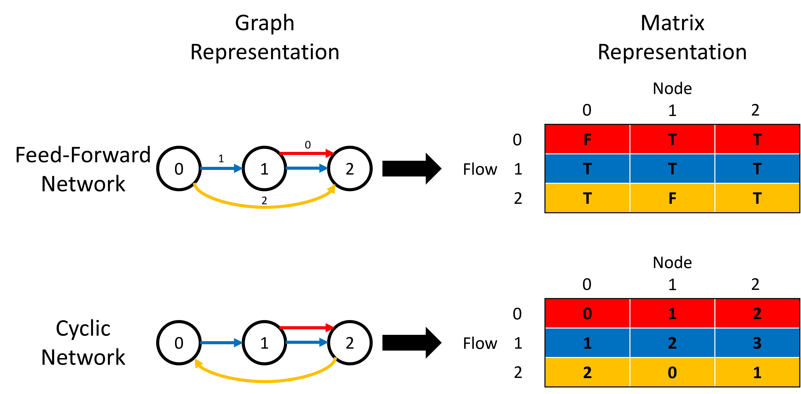

# Network Bandwidth Minimization through Traffic Pacing

## Requirements

We recommend a recent Python 3.7+ distribution of [Anaconda](https://www.anaconda.com/products/individual). To run the algorithm based on solving non-linear programs (NLPs) you also need to install the community edition of Octeract v3.6.0.

## Usage

### Generating Network and Flow Profile

Our algorithm takes network topology, flow profile, and optional link weights as inputs.  Before running the algorithm, you need to first generate some input data. 

We provide scripts that facilitate generating network profile, flow profile, and link weights available through `create_network.py`, `create_flow.py`, and `create_weight.py` respectively in the `input/` sub-directory. Each script allows you to either specify your own profile or generate profile using the build-in functions. You can try these different options by modifying the `main` function (with example code snippets for each option) of each script.

#### Network Profile

We use network profile to specify network topology as well as the route of each flow in the network.  The network profile is represented as an `m × n` matrix, with `m` and `n` being the number of traffic flows and network nodes respectively.

The matrix may either be of type `bool` for feed-forward network or `int` for cyclic network. The following figure demonstrates an example of retrieving network profile matrices given the graph representations of the networks.

    

#### Flow Profile

We use flow profile to specify the token bucket parameters (rate, burst size) as well as the end-to-end latency target of each flow in the network. The flow profile is represented as an `m × 3` matrix, where `m` is the number of flows. The three columns stand for rate, burst size, and latency target respectively.

#### Link Weight

The link weights are presented as an array of `l` non-negative `float`, one for each link, with `l` being the number of links inside the network.

### Bandwidth Minimization

The main script for running the minimization algorithm is `optimization.py`. Running it with `-h` gives you a detailed description over a list of parameters you can control:

- `net`: path to the input network profile.
- `flow`: path to the input flow profile.
- `out`: directory to save the output file.
- `--objective`: type of the objective function.
- `--weight`: path to the link weights if the objective function is selected to be a weighted sum of link bandwidth.
- `--mode`: whether to run the greedy algorithm or the NLP-based algorithm.

### Library

We factor various parts of the code into different modules in the `lib/`
directory. You can begin by looking at the main training script to see how
to make use of these modules.

- `utils.py`: Implement various utility functions (*e.g.,* function to load input data).
- `network_parser.py`: Implement the greedy algorithm as well as the baseline solutions.
- `genetic.py`: A parent class that provides a generic implementation of the genetic algorithm.
- `genetic_twoSlope.py`: Implement a genetic algorithm that performs guided random search to find the best solution based on solving multiple non-linear programs.
- `order_generator.py`: Implement various functions that handle flow orderings.
- `octeract.py`: Formulate the minimization problem into NLPs and call the Octeract engine to solve the generated NLPs.

## License

This code is being released under the [MIT License](LICENSE).
